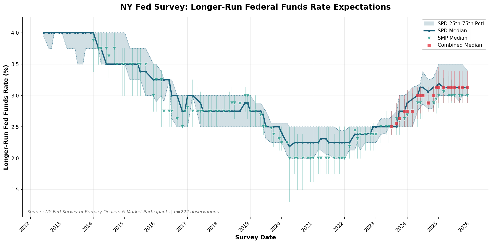
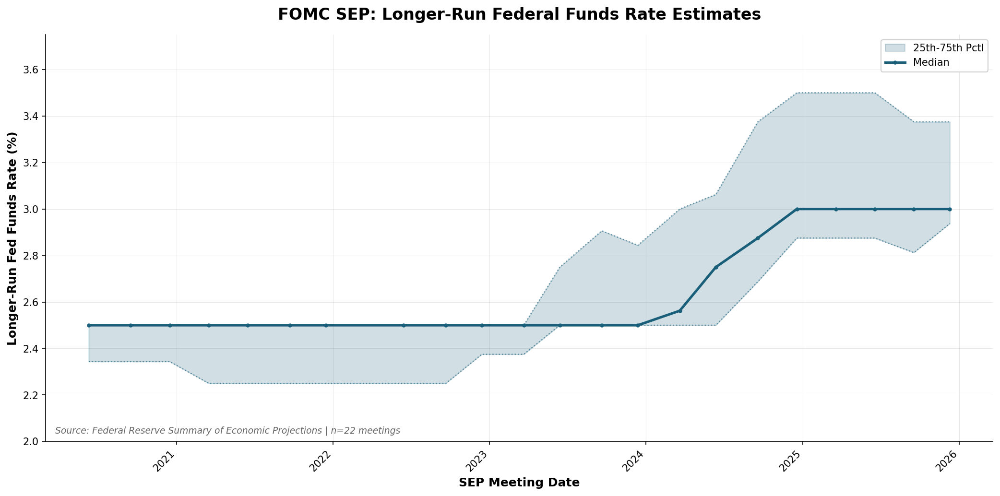

# NY Fed Longer-Run Federal Funds Rate Extractor

A Python tool that extracts "Longer run target federal funds rate" percentiles (25th, median, 75th) from the New York Federal Reserve's Survey of Market Expectations.

## Overview

This project scrapes the [NY Fed Survey of Market Expectations](https://www.newyorkfed.org/markets/market-intelligence/survey-of-market-expectations) page, downloads survey data files, and extracts the longer-run target federal funds rate percentile values into a tidy CSV format.

### Data Sources

The NY Fed publishes survey results in multiple formats across different time periods:

- **2023+**: XLSX data files with structured data
- **2014-2022**: PDF results documents (SPD and SMP surveys)
- **2012-2013**: PDF results documents (combined survey)

### Extraction Strategy

1. **XLSX preferred**: When a "Data" XLSX file exists, extract from it (most reliable)
2. **PDF via LLM**: Send entire PDF to GPT-5.2 for visual table extraction (preserves layout)

## Installation

### Prerequisites

- Python 3.9+
- OpenAI API key (for PDF extraction)

### Setup

```bash
# Clone or navigate to the project
cd neutral-rate-survey

# Create a virtual environment (recommended)
python -m venv venv
source venv/bin/activate  # On Windows: venv\Scripts\activate

# Install dependencies
pip install -r requirements.txt

# Set OpenAI API key for PDF extraction
export OPENAI_API_KEY="your-key-here"
```

## Usage

### Run Full Pipeline

```bash
# Step 1: Download all files (XLSX + PDF)
python scripts/01_scrape_and_download.py --start-year 2011 --end-year 2025

# Step 2: Extract from XLSX files
python scripts/02_extract_xlsx.py

# Step 3: Extract from PDFs using LLM (requires OPENAI_API_KEY)
python scripts/03_extract_pdf_llm.py

# Step 4: Combine data
python scripts/04_combine_and_plot.py

# Or run all steps at once:
python scripts/run_all.py
```

### Output Files

| File | Description |
|------|-------------|
| `data_out/xlsx_extracts.csv` | Data extracted from XLSX files |
| `data_out/pdf_extracts.csv` | Data extracted from PDFs via LLM |
| `data_out/nyfed_ff_longrun_percentiles.csv` | Combined final dataset |
| `data_out/us_rstar_comparison.xlsx` | Comparison with Hartley (2024) data |

## Output Format

The output CSV (`data_out/nyfed_ff_longrun_percentiles.csv`) has the following columns:

| Column | Type | Description |
|--------|------|-------------|
| `survey_date` | YYYY-MM-DD | Date of the survey (first of month) |
| `panel` | string | SPD, SMP, Dealer, Participant, or Combined |
| `concept` | string | Always `ff_longer_run_target` |
| `pctl25` | float | 25th percentile (%, e.g., 3.00) |
| `pctl50` | float | Median/50th percentile (%) |
| `pctl75` | float | 75th percentile (%) |
| `source` | string | `xlsx` or `pdf_llm` |
| `file_url` | string | Relative path to source file |
| `local_path` | string | Path to downloaded file |
| `pdf_page` | int | Page number (PDF sources only) |
| `notes` | string | Notes, e.g., `question_not_present` |

## Project Structure

```
neutral-rate-survey/
├── scripts/                       # Main extraction pipeline
│   ├── 01_scrape_and_download.py  # Download all XLSX & PDF files
│   ├── 02_extract_xlsx.py         # Extract data from XLSX files
│   ├── 03_extract_pdf_llm.py      # Extract data from PDFs using GPT-5.2
│   ├── 04_combine_and_plot.py     # Combine extracts into final CSV
│   └── run_all.py                 # Run full pipeline
├── src/                           # Shared utilities
│   ├── __init__.py
│   ├── utils.py                   # Constants, data classes, utilities
│   ├── scrape_manifest.py         # Scrape survey page for file links
│   ├── download.py                # Download XLSX/PDF files
│   └── extract_xlsx.py            # Parse XLSX files
├── external_data/                 # Reference datasets
│   └── Hartley2024_RStar_12312025.xlsx
├── data_raw/                      # Downloaded files (git-ignored)
├── data_out/                      # Output CSV files
├── .cursorrules                   # Cursor AI rules
├── requirements.txt
└── README.md
```

## Results



The chart shows:
- **SPD (Primary Dealers)**: Continuous line with 25th-75th percentile shading
- **SMP (Market Participants)**: Teal ▼ markers (2014-2023)
- **Combined**: Red ■ markers (July 2023+)

## Validation Against Hartley (2024)

Our extracted data closely matches Hartley (2024), a comprehensive survey of r* estimates. Hartley's US series uses **SPD data for pre-July 2023** and **Combined data for July 2023+**, which we replicate:

| Metric | Value |
|--------|-------|
| Matched observations | 107 |
| Exact matches | 104 (97%) |
| Mean absolute difference | 0.003% |
| Max absolute difference | 0.13% |
| Within 0.1% | 105 (98%) |

**Key finding:** Near-perfect alignment with Hartley's US series when using SPD (pre-July 2023) + Combined (July 2023+).

### Reference

> Hartley, Jonathan, *Survey Measures of the Natural Rate of Interest* (January 01, 2024). Available at SSRN: https://ssrn.com/abstract=5077514 or http://dx.doi.org/10.2139/ssrn.5077514

The Hartley dataset (`external_data/Hartley2024_RStar_12312025.xlsx`) includes:
- **US**: NY Fed Survey (2012-2025)
- **UK**: Bank of England Market Participants Survey (2022-2025)
- **Euro Area**: ECB Survey of Monetary Analysts (2021-2025)
- **Canada**: Bank of Canada Market Participants Survey (2024-2025)

## FOMC SEP Longer-Run Rate Estimates



This chart shows FOMC participants' longer-run federal funds rate estimates from the Summary of Economic Projections (SEP). The data is extracted from the Fed's SEP dot plot publications.

### SEP Pipeline

```bash
python scripts/sep_run_all.py
```

### SEP Output Files

| File | Description |
|------|-------------|
| `data_out/sep_dots.csv` | Raw individual dot values by meeting date and horizon |
| `data_out/sep_summary.csv` | Aggregated percentiles (p25, p50, p75) by meeting date |
| `data_out/sep_longrun_chart.png` | Time series chart of longer-run estimates |

**Note:** Historical PDF extraction (2012-2019) is in progress. The chart currently shows 2020+ data from HTML sources.

## Technical Details

### XLSX Parsing

The XLSX parser handles multiple data formats:

1. **By value_tag**: Looks for `fftr_modalpe_longerrun` in a `value_tag` column
2. **By question text**: Matches text containing "longer run" + "federal funds"
3. **Panel detection**: Automatically detects SPD/SMP/Dealer/Participant columns
4. **Format normalization**: Converts decimal form (0.0313) to percent (3.13)

### PDF Extraction via LLM

PDFs are sent directly to OpenAI's GPT-5.2 model (not text extraction) to preserve visual table layout:

1. PDF encoded as base64 and sent via API
2. Model visually identifies table structure
3. Extracts from "Longer Run" column (not "10-yr Average FF Rate")
4. Returns structured JSON with percentile values

## License

MIT License

## Acknowledgments

**Data Sources:**
- [Federal Reserve Bank of New York - Survey of Market Expectations](https://www.newyorkfed.org/markets/market-intelligence/survey-of-market-expectations)

**Reference Data:**
- Hartley, Jonathan, *Survey Measures of the Natural Rate of Interest* (January 01, 2024). Available at SSRN: https://ssrn.com/abstract=5077514
