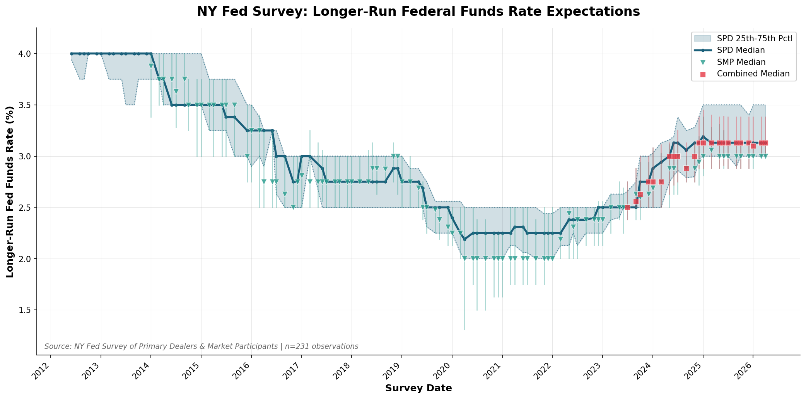
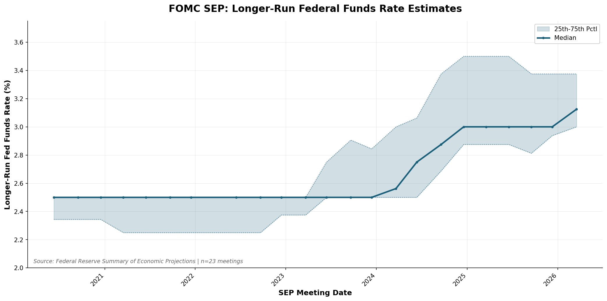
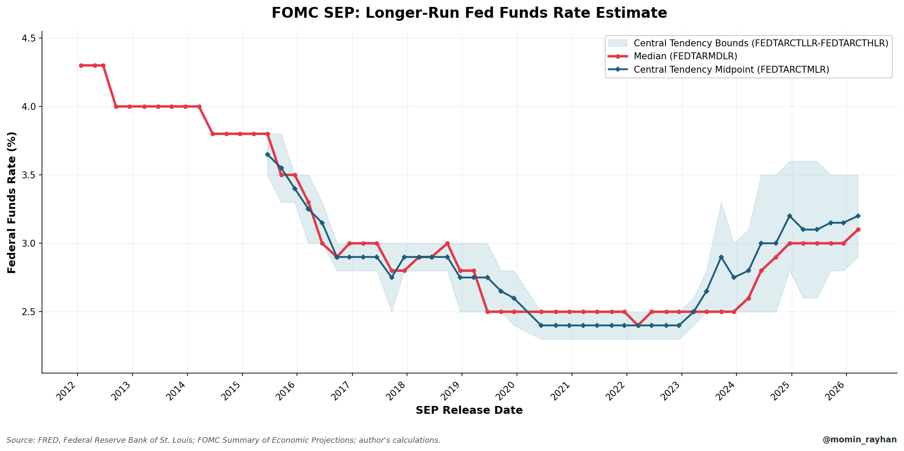
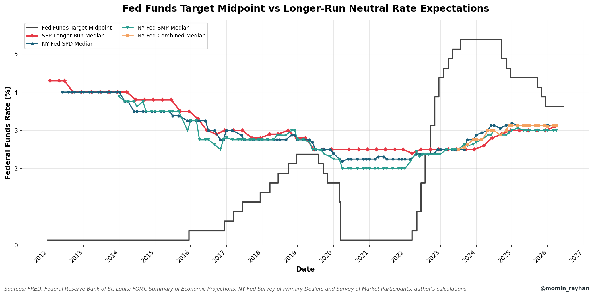
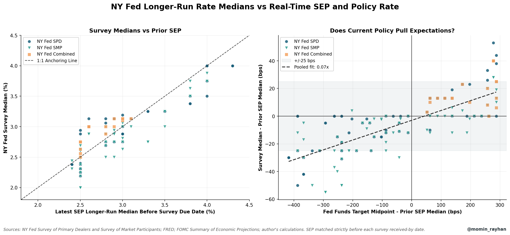
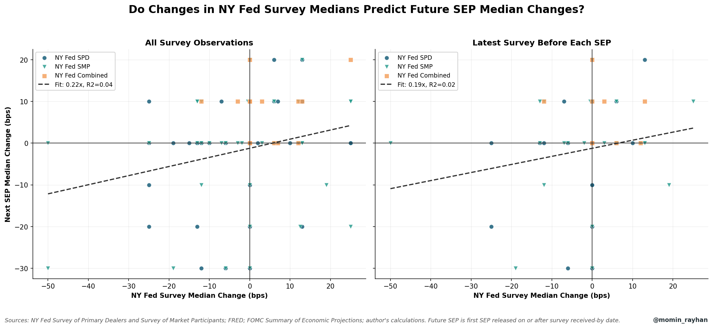
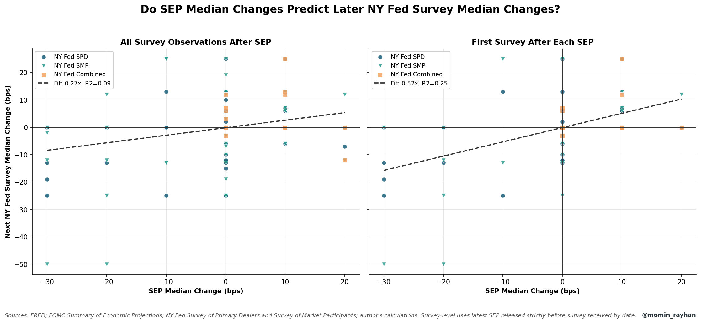
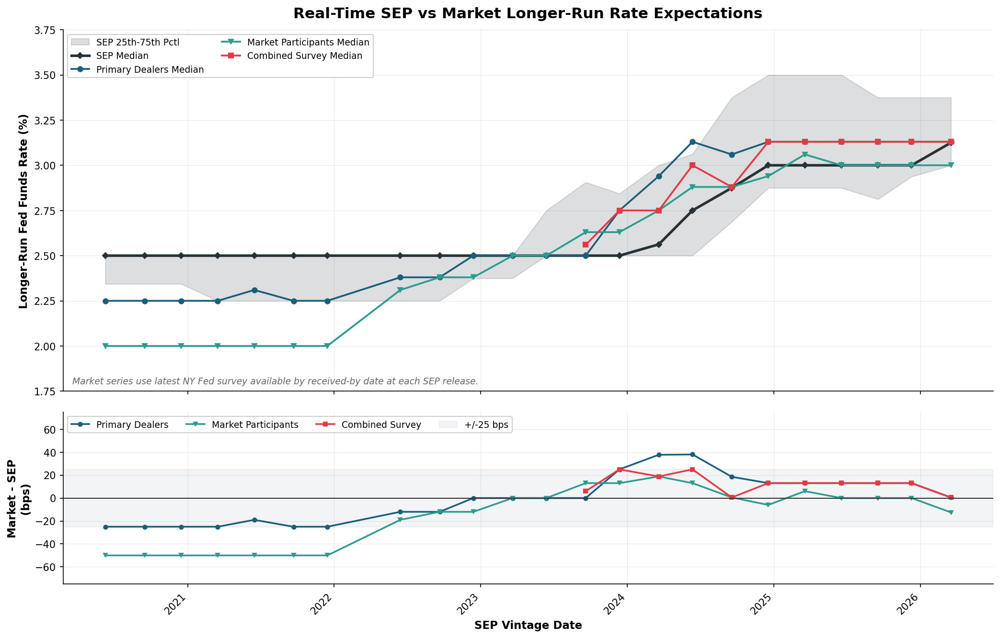

# NY Fed Longer-Run Federal Funds Rate Extractor

A Python tool that extracts "Longer run target federal funds rate" percentiles (25th, median, 75th) from the New York Federal Reserve's Survey of Market Expectations.

## Overview

This project scrapes the [NY Fed Survey of Market Expectations](https://www.newyorkfed.org/markets/market-intelligence/survey-of-market-expectations) page, downloads survey data files, and extracts the longer-run target federal funds rate percentile values into a tidy CSV format.

### Data Sources

The NY Fed publishes survey results in multiple formats across different time periods:

- **2023+**: XLSX data files with structured data
- **2014-2022**: PDF results documents (SPD and SMP surveys)
- **2012-2013**: PDF results documents (combined survey)

### Extraction Strategy

1. **XLSX preferred**: When a "Data" XLSX file exists, extract from it (most reliable)
2. **PDF via LLM**: Send entire PDF to GPT-5.2 for visual table extraction (preserves layout)

## Installation

### Prerequisites

- Python 3.9+
- OpenAI API key (for PDF extraction)

### Setup

```bash
# Clone or navigate to the project
cd neutral-rate-survey

# Create a virtual environment (recommended)
python -m venv venv
source venv/bin/activate  # On Windows: venv\Scripts\activate

# Install dependencies
pip install -r requirements.txt

# Set OpenAI API key for PDF extraction
export OPENAI_API_KEY="your-key-here"
# Set FRED API key for FRED SEP series
export FRED_API_KEY="your-key-here"
# Or add OPENAI_API_KEY=... and FRED_API_KEY=... to a local .env file
```

## Usage

### Run Full Pipeline

```bash
# Step 1: Download all files (XLSX + PDF) through the current year
python scripts/01_scrape_and_download.py --start-year 2011

# Step 2: Extract from XLSX files
python scripts/02_extract_xlsx.py

# Step 3: Extract from PDFs using LLM (requires OPENAI_API_KEY)
python scripts/03_extract_pdf_llm.py

# Step 4: Extract survey receipt deadlines from PDFs
python scripts/extract_survey_receipt_dates.py

# Step 5: Combine data
python scripts/04_combine_and_plot.py

# Or run all steps at once:
python scripts/run_all.py

# After the NY Fed and SEP outputs are current, build the real-time comparison chart:
python scripts/plot_realtime_sep_vs_market.py

# Pull FRED SEP longer-run fed funds median/central tendency series and build the chart:
python scripts/fred_fed_funds_central_tendency.py

# Pull the FRED target range, compute its midpoint, and compare it to neutral-rate expectations:
python scripts/fred_target_midpoint_vs_neutral.py

# Analyze NY Fed anchoring to the latest prior SEP and prevailing target midpoint:
python scripts/analyze_nyfed_sep_anchoring.py

# Analyze whether NY Fed median changes predict future SEP median changes:
python scripts/analyze_nyfed_future_sep_predictive.py

# Analyze whether SEP median changes predict future NY Fed survey median changes:
python scripts/analyze_sep_future_nyfed_predictive.py
```

PDF extraction scripts reuse existing CSV outputs as a cache. By default they
only call OpenAI for uncached PDFs; use `--retry-failed` to reprocess cached
rows without medians or `--force` to reprocess everything.

### Output Files

| File | Description |
|------|-------------|
| `data_out/xlsx_extracts.csv` | Data extracted from XLSX files |
| `data_out/pdf_extracts.csv` | Data extracted from PDFs via LLM |
| `data_out/nyfed_survey_receipt_dates.csv` | Survey distributed and received-by dates extracted from PDF headers |
| `data_out/nyfed_ff_longrun_percentiles.csv` | Combined final dataset |
| `data_out/realtime_sep_vs_market.csv` | SEP vintages aligned to the latest market survey available by receipt date |
| `data_out/realtime_sep_vs_market.png` | Real-time SEP vs market expectations chart |
| `data_out/fred_fed_funds_central_tendency.csv` | FRED SEP longer-run fed funds median and central tendency series |
| `data_out/fred_fed_funds_central_tendency_metadata.csv` | FRED metadata for the longer-run fed funds series |
| `data_out/fred_fed_funds_central_tendency.png` | FRED SEP longer-run fed funds chart |
| `data_out/fed_target_midpoint_vs_neutral.csv` | FRED target range midpoint aligned with SEP and NY Fed neutral-rate medians |
| `data_out/fed_target_midpoint_vs_neutral_metadata.csv` | FRED metadata for target range and SEP median series |
| `data_out/fed_target_midpoint_vs_neutral.png` | Fed target midpoint vs neutral-rate expectations chart |
| `data_out/nyfed_sep_anchor_analysis.csv` | Survey medians aligned to the latest prior SEP and target midpoint by received-by date |
| `data_out/nyfed_sep_anchor_summary.csv` | Anchoring gap summary by survey panel |
| `data_out/nyfed_sep_anchor_regressions.csv` | OLS models for SEP anchoring and target midpoint influence |
| `data_out/nyfed_sep_anchor_analysis.png` | Anchoring diagnostic chart |
| `data_out/nyfed_future_sep_predictive_analysis.csv` | Survey-level panel of survey median changes aligned to future SEP changes |
| `data_out/nyfed_future_sep_predictive_event_analysis.csv` | Latest-survey-before-SEP event-level predictive panel |
| `data_out/nyfed_future_sep_predictive_summary.csv` | Predictive summary statistics by panel and sample type |
| `data_out/nyfed_future_sep_predictive_regressions.csv` | OLS models for future SEP changes on survey median changes |
| `data_out/nyfed_future_sep_predictive.png` | Predictive diagnostic chart |
| `data_out/sep_future_nyfed_predictive_analysis.csv` | Survey-level panel of SEP median changes aligned to later survey changes |
| `data_out/sep_future_nyfed_predictive_event_analysis.csv` | First-survey-after-SEP event-level predictive panel |
| `data_out/sep_future_nyfed_predictive_summary.csv` | Reverse predictive summary statistics by panel and sample type |
| `data_out/sep_future_nyfed_predictive_regressions.csv` | OLS models for survey changes on prior SEP changes |
| `data_out/sep_future_nyfed_predictive.png` | Reverse predictive diagnostic chart |
| `data_out/us_rstar_comparison.xlsx` | Comparison with Hartley (2024) data |

## Output Format

The output CSV (`data_out/nyfed_ff_longrun_percentiles.csv`) has the following columns:

| Column | Type | Description |
|--------|------|-------------|
| `survey_date` | YYYY-MM-DD | Date of the survey (first of month) |
| `panel` | string | SPD, SMP, Dealer, Participant, or Combined |
| `distributed_date` | YYYY-MM-DD | Date the survey was distributed |
| `received_by_date` | YYYY-MM-DD | Date survey responses were due/received by |
| `concept` | string | Always `ff_longer_run_target` |
| `pctl25` | float | 25th percentile (%, e.g., 3.00) |
| `pctl50` | float | Median/50th percentile (%) |
| `pctl75` | float | 75th percentile (%) |
| `source` | string | `xlsx` or `pdf_llm` |
| `file_url` | string | Relative path to source file |
| `local_path` | string | Path to downloaded file |
| `pdf_page` | int | Page number (PDF sources only) |
| `receipt_source_file` | string | PDF used to extract distributed/received-by dates |
| `notes` | string | Notes, e.g., `question_not_present` |

## Project Structure

```
neutral-rate-survey/
├── scripts/                       # Main extraction pipeline
│   ├── 01_scrape_and_download.py  # Download all XLSX & PDF files
│   ├── 02_extract_xlsx.py         # Extract data from XLSX files
│   ├── 03_extract_pdf_llm.py      # Extract data from PDFs using GPT-5.2
│   ├── 04_combine_and_plot.py     # Combine extracts into final CSV
│   ├── analyze_nyfed_future_sep_predictive.py # Analyze survey changes vs future SEP changes
│   ├── analyze_nyfed_sep_anchoring.py # Analyze survey anchoring to SEP and target midpoint
│   ├── analyze_sep_future_nyfed_predictive.py # Analyze SEP changes vs future survey changes
│   ├── fred_target_midpoint_vs_neutral.py # Compare FRED target midpoint to neutral estimates
│   ├── fred_fed_funds_central_tendency.py # Pull FRED SEP central tendency series
│   ├── plot_realtime_sep_vs_market.py # Compare SEP vintages to market expectations
│   └── run_all.py                 # Run full pipeline
├── src/                           # Shared utilities
│   ├── __init__.py
│   ├── utils.py                   # Constants, data classes, utilities
│   ├── scrape_manifest.py         # Scrape survey page for file links
│   ├── download.py                # Download XLSX/PDF files
│   └── extract_xlsx.py            # Parse XLSX files
├── external_data/                 # Reference datasets
│   └── Hartley2024_RStar_12312025.xlsx
├── data_raw/                      # Downloaded files (git-ignored)
├── data_out/                      # Output CSV files
├── .cursorrules                   # Cursor AI rules
├── requirements.txt
└── README.md
```

## Results



The chart shows:
- **SPD (Primary Dealers)**: Continuous line with 25th-75th percentile shading
- **SMP (Market Participants)**: Teal ▼ markers (2014-2023)
- **Combined**: Red ■ markers (July 2023+)

## Validation Against Hartley (2024)

Our extracted data closely matches Hartley (2024), a comprehensive survey of r* estimates. Hartley's US series uses **SPD data for pre-July 2023** and **Combined data for July 2023+**, which we replicate:

| Metric | Value |
|--------|-------|
| Matched observations | 107 |
| Exact matches | 104 (97%) |
| Mean absolute difference | 0.003% |
| Max absolute difference | 0.13% |
| Within 0.1% | 105 (98%) |

**Key finding:** Near-perfect alignment with Hartley's US series when using SPD (pre-July 2023) + Combined (July 2023+).

### Reference

> Hartley, Jonathan, *Survey Measures of the Natural Rate of Interest* (January 01, 2024). Available at SSRN: https://ssrn.com/abstract=5077514 or http://dx.doi.org/10.2139/ssrn.5077514

The Hartley dataset (`external_data/Hartley2024_RStar_12312025.xlsx`) includes:
- **US**: NY Fed Survey (2012-2025)
- **UK**: Bank of England Market Participants Survey (2022-2025)
- **Euro Area**: ECB Survey of Monetary Analysts (2021-2025)
- **Canada**: Bank of Canada Market Participants Survey (2024-2025)

## FOMC SEP Longer-Run Rate Estimates



This chart shows FOMC participants' longer-run federal funds rate estimates from the Summary of Economic Projections (SEP). The data is extracted from the Fed's SEP dot plot publications.

### SEP Pipeline

```bash
python scripts/sep_run_all.py
```

### SEP Output Files

| File | Description |
|------|-------------|
| `data_out/sep_dots.csv` | Raw individual dot values by meeting date and horizon |
| `data_out/sep_summary.csv` | Aggregated percentiles (p25, p50, p75) by meeting date |
| `data_out/sep_longrun_chart.png` | Time series chart of longer-run estimates |
| `data_out/fred_fed_funds_central_tendency.csv` | FRED longer-run series: FEDTARMDLR, FEDTARCTLLR, FEDTARCTMLR, FEDTARCTHLR |
| `data_out/fred_fed_funds_central_tendency_metadata.csv` | FRED metadata for the longer-run fed funds series |
| `data_out/fred_fed_funds_central_tendency.png` | FRED longer-run fed funds median and central tendency chart |
| `data_out/fed_target_midpoint_vs_neutral.csv` | Daily FRED target range midpoint plus SEP and NY Fed neutral-rate medians |
| `data_out/fed_target_midpoint_vs_neutral_metadata.csv` | FRED metadata for DFEDTARL, DFEDTARU, and FEDTARMDLR |
| `data_out/fed_target_midpoint_vs_neutral.png` | Fed target midpoint vs longer-run neutral-rate expectations chart |
| `data_out/nyfed_sep_anchor_analysis.csv` | NY Fed survey medians aligned to latest prior SEP and prevailing target midpoint |
| `data_out/nyfed_sep_anchor_summary.csv` | Anchoring summary statistics by panel |
| `data_out/nyfed_sep_anchor_regressions.csv` | OLS estimates for SEP anchoring and target midpoint influence |
| `data_out/nyfed_sep_anchor_analysis.png` | Diagnostic anchoring chart |
| `data_out/nyfed_future_sep_predictive_analysis.csv` | Survey-level changes matched to the next SEP change |
| `data_out/nyfed_future_sep_predictive_event_analysis.csv` | Latest-survey-before-SEP changes matched to each SEP event |
| `data_out/nyfed_future_sep_predictive_summary.csv` | Predictive statistics by panel and sample type |
| `data_out/nyfed_future_sep_predictive_regressions.csv` | OLS estimates for future SEP changes on survey changes |
| `data_out/nyfed_future_sep_predictive.png` | Future SEP predictive diagnostic chart |
| `data_out/sep_future_nyfed_predictive_analysis.csv` | Survey-level changes matched to the latest prior SEP change |
| `data_out/sep_future_nyfed_predictive_event_analysis.csv` | First survey after each SEP release matched to that SEP change |
| `data_out/sep_future_nyfed_predictive_summary.csv` | Reverse predictive statistics by panel and sample type |
| `data_out/sep_future_nyfed_predictive_regressions.csv` | OLS estimates for survey changes on prior SEP changes |
| `data_out/sep_future_nyfed_predictive.png` | Future NY Fed survey predictive diagnostic chart |

**Note:** Historical PDF extraction (2012-2019) is in progress. The chart currently shows 2020+ data from HTML sources.

SEP outputs include `data_vintage_date`, which is the FOMC statement and SEP
release date. For current HTML projection tables and historical SEP PDFs, this
matches `meeting_date`.

### FRED Longer-Run Fed Funds Central Tendency



```bash
python scripts/fred_fed_funds_central_tendency.py
```

This pulls FRED series `FEDTARMDLR`, `FEDTARCTLLR`, `FEDTARCTMLR`, and
`FEDTARCTHLR`, which are the FOMC SEP longer-run fed funds rate median and
central tendency low, midpoint, and high. FRED publishes these observations by
SEP release date. The median series starts in 2012; the central tendency series
start in 2015.

The chart plots `FEDTARMDLR` and `FEDTARCTMLR` as separate lines, with the
central tendency bounds shaded between `FEDTARCTLLR` and `FEDTARCTHLR`.

### Fed Target Midpoint vs Neutral Expectations



```bash
python scripts/fred_target_midpoint_vs_neutral.py
```

This pulls FRED series `DFEDTARL` and `DFEDTARU`, computes the target-range
midpoint as `(lower + upper) / 2`, and plots it against `FEDTARMDLR` and the NY
Fed survey medians from `data_out/nyfed_ff_longrun_percentiles.csv`.

### NY Fed Survey Anchoring to SEP



```bash
python scripts/analyze_nyfed_sep_anchoring.py
```

This aligns each NY Fed survey median to the latest SEP longer-run median
released strictly before the survey `received_by_date`, then joins the prevailing
fed funds target midpoint on that same received-by date. The outputs report
survey-minus-SEP gaps and simple OLS models for the effect of the target midpoint
on survey medians.

### NY Fed Survey Changes vs Future SEP Changes



```bash
python scripts/analyze_nyfed_future_sep_predictive.py
```

This tests whether changes in NY Fed survey medians predict the next SEP
longer-run median change. For each survey observation, the future SEP is the
first SEP released on or after the survey `received_by_date`; the SEP change is
measured relative to the latest prior SEP. The event-level output also keeps only
the latest survey received before each SEP release for each panel.

### SEP Changes vs Future NY Fed Survey Changes



```bash
python scripts/analyze_sep_future_nyfed_predictive.py
```

This tests whether SEP longer-run median changes predict later NY Fed survey
median changes. The survey-level output matches each survey to the latest SEP
change released strictly before the survey `received_by_date`; the event-level
output keeps the first survey received after each SEP release for each panel.

## Real-Time SEP vs Market Expectations



This chart compares each SEP longer-run federal funds rate vintage with the
latest NY Fed survey expectations that were available by that SEP release date.
Market availability is determined using `received_by_date <= data_vintage_date`,
so the comparison avoids looking ahead to later surveys.

The top panel plots SEP and market medians. The bottom panel plots the real-time
market-minus-SEP gap in basis points, with a +/-25 bp band for quick anchoring
checks.

### Real-Time Comparison Output Files

| File | Description |
|------|-------------|
| `data_out/realtime_sep_vs_market.csv` | One row per SEP vintage and available market survey panel |
| `data_out/realtime_sep_vs_market.png` | Two-panel chart of market expectations versus the SEP |

## Technical Details

### XLSX Parsing

The XLSX parser handles multiple data formats:

1. **By value_tag**: Looks for `fftr_modalpe_longerrun` in a `value_tag` column
2. **By question text**: Matches text containing "longer run" + "federal funds"
3. **Panel detection**: Automatically detects SPD/SMP/Dealer/Participant columns
4. **Format normalization**: Converts decimal form (0.0313) to percent (3.13)

### PDF Extraction via LLM

PDFs are sent directly to OpenAI's GPT-5.2 model (not text extraction) to preserve visual table layout:

1. PDF encoded as base64 and sent via API
2. Model visually identifies table structure
3. Extracts from "Longer Run" column (not "10-yr Average FF Rate")
4. Returns structured JSON with percentile values

## License

MIT License

## Acknowledgments

**Data Sources:**
- [Federal Reserve Bank of New York - Survey of Market Expectations](https://www.newyorkfed.org/markets/market-intelligence/survey-of-market-expectations)

**Reference Data:**
- Hartley, Jonathan, *Survey Measures of the Natural Rate of Interest* (January 01, 2024). Available at SSRN: https://ssrn.com/abstract=5077514
